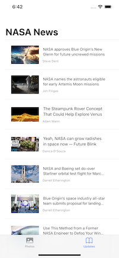
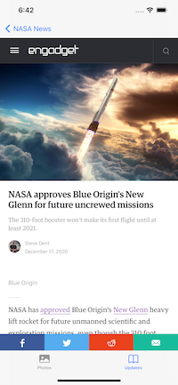

# LiveOnMars
One place for checking on any relevent news on NASA or having a look at some amazing photography

## API Keys
<a href="https://newsapi.org"> NewsAPI Key</a> 

<a href="https://api.nasa.gov"> NASA API Key</a>

## Screenshots
 &ensp;
 &ensp;

## Table of contents
* [General info](#general-info)
* [Features](#features)
* [Future Features](#FutureFeatures)
* [Status](#status)
* [Inspiration](#inspiration)
* [Contact](#contact)

## General info
I wanted more practice integrating third party APIs into some of my work and specifically working with JSON. The PhotoView is achieved using SDWebImageView and its provided features whilst the NewsView is built around using the native networking APIs to display and cache the JSON

## Features
* A news feed pulling all relevant news about NASA using NewsAPI.org. All articles are displayed within a List and from said list a user can read the full article in a WebView

## Future Features
* Photos being displayed from a NASA API

## Status
* Still in development

## Special Thanks
<a href="https://github.com/SDWebImage/SDWebImageSwiftUI">SDWebImage</a> - For enabling a simpler way of parsing JSON with SwiftUI

## Contact
Created by [Marc Harvey](https://www.linkedin.com/in/marc-harvey-lru/) - feel free to contact me!
