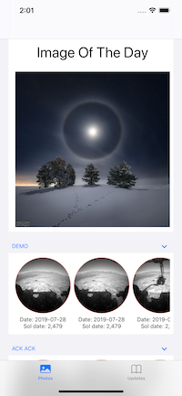
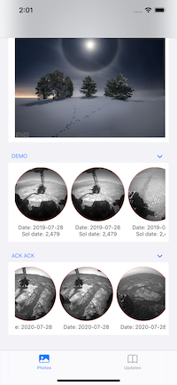

# LiveOnMars
One place for checking on any relevent news on NASA or having a look at some amazing photography from the Martian Rovers

## API Keys
<a href="https://newsapi.org">NewsAPI Key</a> 

<a href="https://api.nasa.gov">NASA API Key</a>

## Screenshots
 &ensp;
 &ensp;
 &ensp;
 &ensp;

## Table of contents
* [General info](#general-info)
* [Features](#features)
* [Future Features](#FutureFeatures)
* [Status](#status)
* [Inspiration](#inspiration)
* [Contact](#contact)

## General info
I wanted more practice integrating third party APIs into some of my work and specifically working with JSON. The PhotoView is achieved using SDWebImageView and its provided features whilst the NewsView is built around using the native networking APIs to display and cache the JSON

## Features
* A news feed pulling all relevant news about NASA using NewsAPI.org. All articles are displayed within a List and from said list a user can read the full article in a WebView
* Another feed from a NASA API that displays some images taken from the Martian Rovers

## Future Features
Allow the user to define the date/Rover/camera that they see in their feed. Should just be a case of interpolating the URL that's being used and letting the user alter the different parts of the URL accordingly. In terms of UI, I think that maybe using a Picker to allow this

## Status
* Still in development

## Special Thanks
<a href="https://github.com/SDWebImage/SDWebImageSwiftUI">SDWebImage</a> - For enabling a simpler way of parsing images held on JSON with SwiftUI

## Contact
Created by [Marc Harvey](https://www.linkedin.com/in/marc-harvey-lru/) - feel free to contact me!
